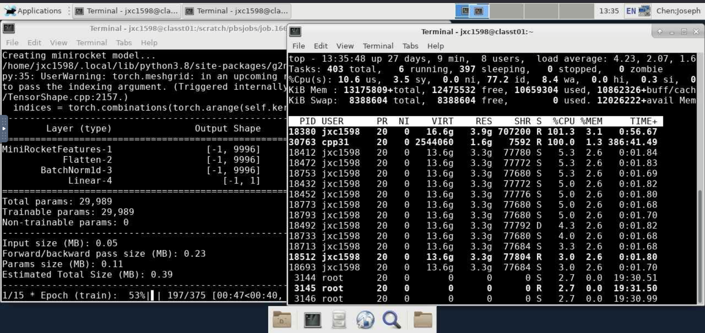
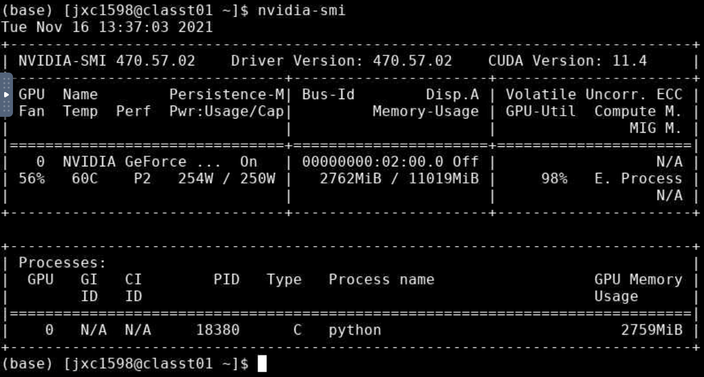
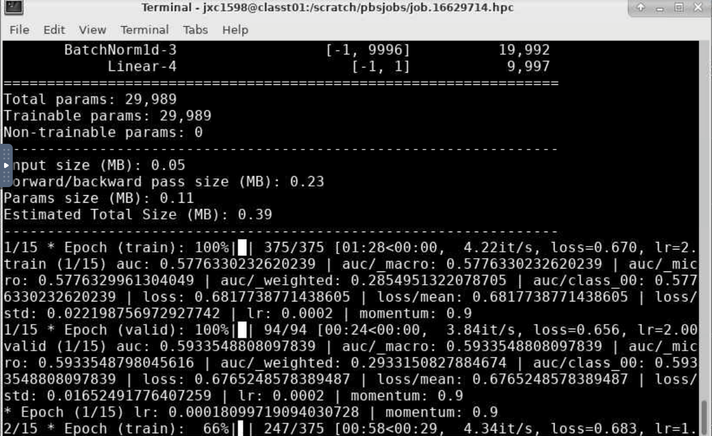
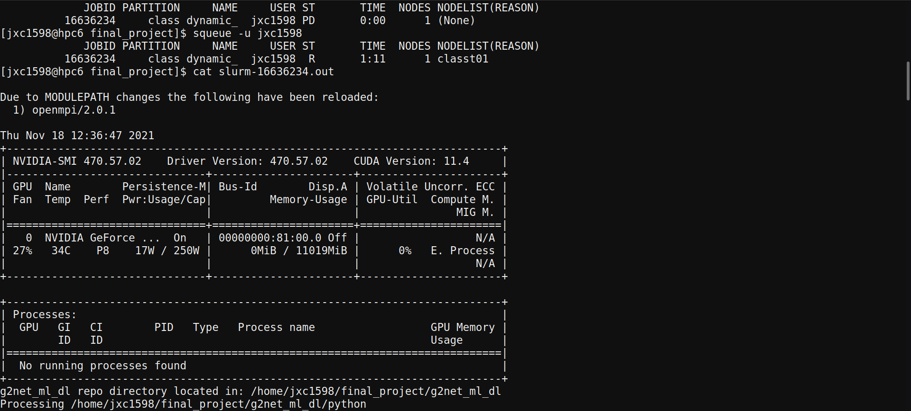
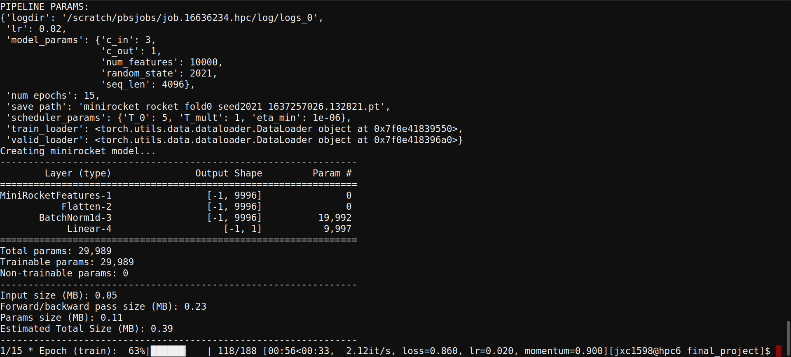

# Training MiniRocket

## With multiprocessing (Interactive)

Epochs went from 13min/epoch to 1 min/epoch.

CPU Usage jumped to 100+%.

GPU Usage still quite low.

**Job ID:** 16629714

---

## With batch script

**Job ID:** 16629978

## With lr=0.02

**Job ID:** 16636234

# Inference

**Job ID:** 16640414

- batch_size = OOM

**Job ID:** 16640594

- batch_size = 64
- OOM

**Job ID:** 16640621

**Job ID:** 16640826

## Fixed Eval Pipeline

**Job ID:** 16641075
